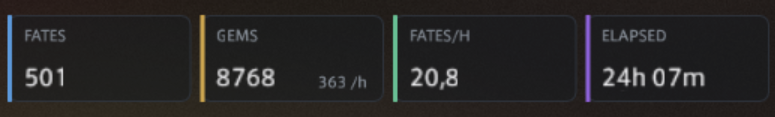

<p align="center">
  
</p>

<h1 align="center">Auto FATE Grind</h1>

<p align="center">
  <a href="https://github.com/XeldarAlz/FFXIV-AutoFATEGrind/releases/latest"></a>
  <a href="https://github.com/XeldarAlz/FFXIV-AutoFATEGrind/releases"></a>
  <a href="https://github.com/XeldarAlz/FFXIV-AutoFATEGrind/actions/workflows/release.yml"></a>
  <a href="LICENSE.md"></a>
</p>

<p align="center">
  <em>FATEs, farmed for you. Built on Dalamud.</em>
</p>

---

<p align="center">
  
</p>

<p align="center">
  <strong>Example 24 hours full AFK run:</strong><br>
  
</p>

## What it does

Lists every FATE zone from A Realm Reborn through Dawntrail in one window. Tick the zones you want, press **Run selected**, and the plugin teleports to each one, scans for active FATEs, flies to them, engages, and rotates to the next selected zone when the current one runs dry.

## Features

- **Zone picker**: pick any FATE zones from ARR through DT, with live active-FATE counts.
- **Four grind modes**: farm to a Gemstone target, run N FATEs, run for a set time, or go endless.
- **FATE filters & priority**: skip by type, time left, or progress, and reorder how the next FATE is chosen.
- **Live FATE tracker**: shown inline, or as a separate HUD overlay.
- **Class queue**: cycle gearsets in order with per-class level caps.
- **Auto-trade**: spends Bicolor Gemstones at the trader once you hit your threshold.
- **Auto-repair**: Dark Matter first, Grand Company mender as fallback.
- **Auto-consume**: keeps food and medicine buffs up (Well Fed is a free +3% EXP), HQ first.
- **Humanizer**: takes random city breaks between FATEs so long sessions look less mechanical.
- **Party invites**: auto-declines incoming invites during a run after a random delay, with an optional reply message.
- **GM alert**: stops the bot when a GM is near, with optional toast, beeps, or custom commands.
- **Resilient**: cancellable mid-run, and your selection persists across reloads.

## Install

In-game: `/xlsettings` → **Experimental** → paste into **Custom Plugin Repositories**:

```
https://raw.githubusercontent.com/XeldarAlz/DalamudPlugins/main/repo.json
```

Tick **Enabled**, click **+**, then **Save and Close**. Open `/xlplugins` → **All Plugins**, search for **Auto FATE Grind**, and install.

The plugin needs a few helpers for movement and combat to be installed and loaded. Open `/afg deps` after install to see the list and one-click each missing one.

## Commands

| Command | Action |
|---|---|
| `/afg` | Toggle the main window |
| `/fategrind` | Alias for `/afg` |
| `/afg config` | Open settings |
| `/afg deps` | Open dependencies window |
| `/afg about` | Open credits / links |
| `/afg target` | Log targeted NPC's BaseId (debug helper) |

## More from me

If you liked this plugin, take a look at my other Dalamud work. You might find something else there for you.

→ [XeldarAlz Dalamud Plugins](https://github.com/XeldarAlz/DalamudPlugins)

## License

AGPL-3.0-or-later. See [LICENSE.md](LICENSE.md).
