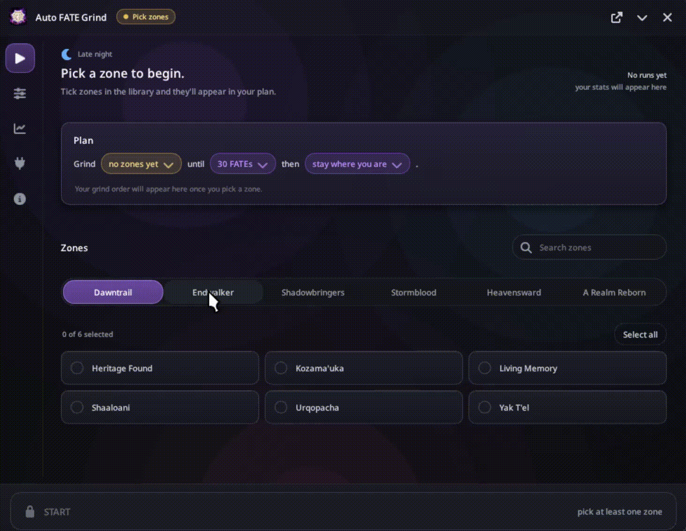
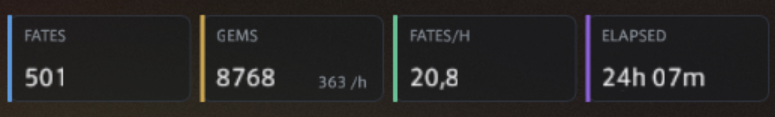

<p align="center">
  
</p>

<h1 align="center">Auto FATE Grind</h1>

<p align="center">
  <a href="https://github.com/XeldarAlz/FFXIV-AutoFATEGrind/releases/latest"></a>
  <a href="https://github.com/XeldarAlz/FFXIV-AutoFATEGrind/releases"></a>
  <a href="https://github.com/XeldarAlz/FFXIV-AutoFATEGrind/actions/workflows/release.yml"></a>
  <a href="LICENSE.md"></a>
</p>

<p align="center">
  <em>FATEs, farmed for you. Built on Dalamud.</em>
</p>

---

<p align="center">
  
</p>

<p align="center">
  <strong>Example 24 hours full AFK run:</strong><br>
  
</p>

## What it does

Lists every FATE zone from A Realm Reborn through Dawntrail in one window. Tick the zones you want, press **Run selected**, and the plugin teleports to each one, scans for active FATEs, flies to them, engages, and rotates to the next selected zone when the current one runs dry.

## Features

- **Zone picker**: pick any FATE zones from ARR through DT, with live active-FATE counts.
- **Four grind modes**: farm to a Gemstone target, run N FATEs, run for a set time, or go endless.
- **FATE filters & priority**: skip by type, time left, or progress, and reorder how the next FATE is chosen.
- **Live FATE tracker**: shown inline, or as a separate HUD overlay.
- **Class queue**: cycle gearsets in order with per-class level caps.
- **Auto-trade**: spends Bicolor Gemstones at the trader once you hit your threshold.
- **Auto-repair**: Dark Matter first, Grand Company mender as fallback.
- **Auto-consume**: keeps food and medicine buffs up (Well Fed is a free +3% EXP), HQ first.
- **Humanizer**: takes random city breaks between FATEs so long sessions look less mechanical.
- **Party invites**: auto-declines incoming invites during a run after a random delay, with an optional reply message.
- **GM alert**: stops the bot when a GM is near, with optional toast, beeps, or custom commands.
- **Resilient**: cancellable mid-run, and your selection persists across reloads.

## Install

In-game: `/xlsettings` → **Experimental** → paste into **Custom Plugin Repositories**:

```
https://raw.githubusercontent.com/XeldarAlz/DalamudPlugins/main/repo.json
```

Tick **Enabled**, click **+**, then **Save and Close**. Open `/xlplugins` → **All Plugins**, search for **Auto FATE Grind**, and install.

The plugin needs a few helpers for movement and combat to be installed and loaded. Open `/afg deps` after install to see the list and one-click each missing one.

## Commands

| Command | Action |
|---|---|
| `/afg` | Toggle the main window |
| `/fategrind` | Alias for `/afg` |
| `/afg toggle` | Start or stop the grind |
| `/afg config` | Open settings |
| `/afg deps` | Open dependencies window |
| `/afg about` | Open credits / links |
| `/afg target` | Log targeted NPC's BaseId (debug helper) |

## Driving AFG over IPC

Auto FATE Grind registers a small IPC control surface so other Dalamud plugins can start, stop, and configure a run. All endpoints live under the `AutoFateGrind.` prefix. Overrides you pass are **session-only**: they apply to a single run and are never written to the plugin's saved settings, so a crash or reload cannot change the user's configuration.

| Endpoint | Signature | Purpose |
|---|---|---|
| `AutoFateGrind.Control.APIVersion` | `int()` | IPC version; check before calling anything else. |
| `AutoFateGrind.Control.IsRunning` | `bool()` | True while a run is active. |
| `AutoFateGrind.Control.Start` | `bool()` | Start a run using the user's saved settings. Returns true if a run began. |
| `AutoFateGrind.Control.StartWith` | `bool(List<uint>, string, int?, int?, List<uint>)` | Start a run with per-run overrides. Returns true if a run began. |
| `AutoFateGrind.Control.Stop` | `void()` | Stop the current run (no-op if idle). |
| `AutoFateGrind.Control.Toggle` | `bool()` | Start if idle, stop if running. Returns the resulting running state. |

`StartWith` takes the overrides as primitives, in order. Any argument may be null to keep the user's saved value for that category:

- `zones`: `List<uint>` of TerritoryType RowIds to grind; unknown ids are ignored.
- `modeId`: `string`, one of `maxgemstones`, `runcount`, `timeboxed`, `endless`. An unknown id rejects the start.
- `stopValue`: `int?`, the target for the chosen mode (gemstones, FATE count, or minutes; ignored for `endless`).
- `gearsetIndex`: `int?`, a 1-based gear set to play for the run. If the slot is empty or holds a non-combat job, the run keeps the current class instead of switching. Pass `null` to use the user's saved class queue.
- `avoidedFates`: `List<uint>` of overworld FATE ids to skip. These are added to the user's existing avoid list, not replaced.

Subscribe with raw Dalamud call gates (no ECommons dependency required). The generic types must match exactly, including the nullable `int?` parameters:

```csharp
// Compatibility check first (pi is your IDalamudPluginInterface).
var apiVersion = pi.GetIpcSubscriber<int>("AutoFateGrind.Control.APIVersion");
try { if (apiVersion.InvokeFunc() != 1) return; }
catch (Dalamud.Plugin.Ipc.Exceptions.IpcNotReadyError) { return; } // AFG not loaded

// Start a one-hour timed run in the user's saved zones, on gear set 3, avoiding two FATEs.
var startWith = pi.GetIpcSubscriber<List<uint>, string, int?, int?, List<uint>, bool>(
    "AutoFateGrind.Control.StartWith");
bool started = startWith.InvokeFunc(null, "timeboxed", 60, 3, new List<uint> { 1831, 1832 });

// Query, stop, toggle.
bool running = pi.GetIpcSubscriber<bool>("AutoFateGrind.Control.IsRunning").InvokeFunc();
pi.GetIpcSubscriber<object>("AutoFateGrind.Control.Stop").InvokeAction();
bool nowRunning = pi.GetIpcSubscriber<bool>("AutoFateGrind.Control.Toggle").InvokeFunc();
```

Notes:

- Only primitives, `string`, and `List<uint>` cross the boundary; AFG does not expose its own types.
- `Stop` is a void action: subscribe as `GetIpcSubscriber<object>` and call `InvokeAction`.
- Pass `null` for a category to keep the user's saved value. An empty `zones` list means "no zones" and does not start a run, so use `null`, not an empty list, to fall back to the saved zone selection.

## More from me

If you liked this plugin, take a look at my other Dalamud work. You might find something else there for you.

→ [XeldarAlz Dalamud Plugins](https://github.com/XeldarAlz/DalamudPlugins)

## License

AGPL-3.0-or-later. See [LICENSE.md](LICENSE.md).
